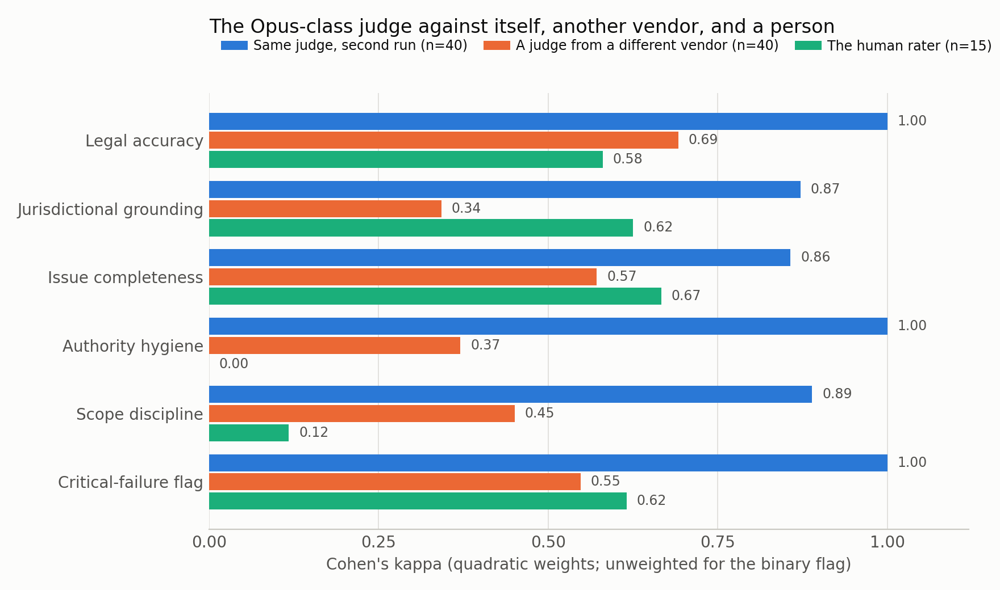
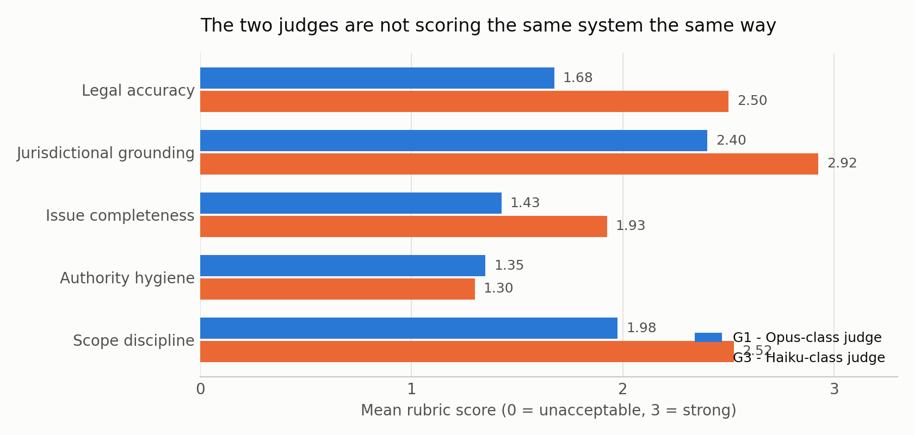
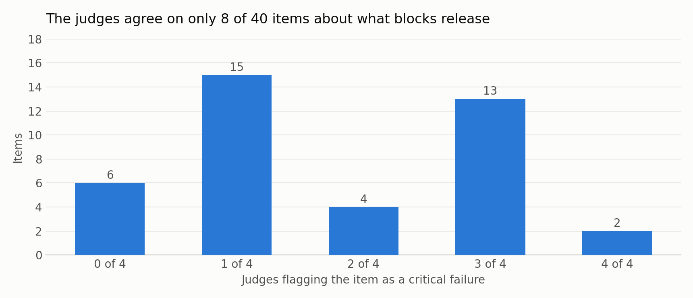
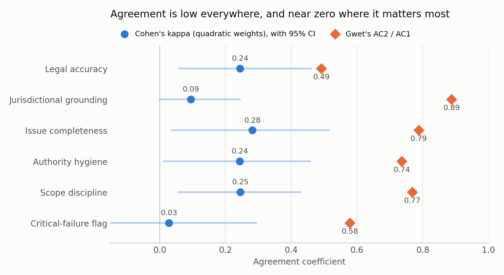

# legal-eval — do two AI judges scoring legal answers measure the same thing?

**What was evaluated.** 40 legal questions written for this study across
commercial contracts and UCC, corporate / M&A / tax / antitrust, employment,
litigation procedure and privilege, data privacy and AI regulation, IP and trade
secrets, real estate, and legal ethics. Sixteen are tied to a named jurisdiction
(Delaware, California, New York, the EU, England and Wales). Each carries a gold
reference — the material points a competent answer must cover, the specific trap
the item is built around, and the authorities a practitioner would expect. A
Haiku-class model answered all 40 under two documented prompt conditions: normal,
and "direct, no caveats, under 80 words".

**By what rubric.** Five ordinal 0–3 dimensions with behavioural anchors — legal
accuracy, jurisdictional grounding, issue completeness, authority hygiene, scope
discipline — plus a binary critical-failure flag for fabricated authority,
confidently inverted rules, jurisdiction substitution, and missed dispositive
deadlines. Rationales are mandatory. Full text in
[`docs/rubric.md`](docs/rubric.md).

**Who scored it.** Eight rating passes: three model tiers (Opus-, Sonnet- and
Haiku-class), a human rater on 15 items, two test–retest repeats, and one
ablation with the gold reference withheld. Statistics: Cohen's kappa (plain and
quadratically weighted), Fleiss' kappa, Krippendorff's alpha, Gwet's AC1/AC2,
bootstrap CIs — implemented from scratch in [`src/agreement.py`](src/agreement.py)
and validated against published worked examples and two reference packages.

## Decision implication for a production legal-AI evaluation program

If these results held at scale, four things would follow for a team running
evaluation on a legal product. They are what the study is *for*; the statistics
are how it got there.

1. **Never gate a release on a single LLM judge.** Between-judge flag rates on the
   same answers ranged from 8% to 75%. A pass rate is a property of the judge
   before it is a property of the system.
2. **Select judges on item-level agreement with a human, never on matching
   aggregate rates.** The two are actively misleading here: the judge that matched
   the human's average severity exactly was the one that agreed with her least.
3. **Route by tier rather than choosing one judge.** A low-cost judge tracks
   *relative* movement between releases at a fraction of the cost, but caught none
   of the human-flagged critical failures. Use it for regression signal; send
   everything it scores low, plus a random sample of the rest, to a
   higher-capability judge, and take absolute safety numbers only from that tier.
4. **Budget for gold references before judges.** Removing the gold reference cost
   a judge a third of its agreement with itself and collapsed citation checking
   almost entirely. The answer key was doing much of the work that looked like
   legal judgment - which means the expensive, expert, un-automatable part is
   still the expensive part.

## What came out

1. **Judges flagged between 8% and 75% of the same answers as release blockers.**
2. **That divergence is not sampling noise.** Re-running each judge on the same
   items reproduced its own scores at weighted kappa **0.86–1.00** — the
   Opus-class judge reproduced all 18 of its flags exactly — while agreement
   *between* judges ran 0.09–0.78. On one repeat, the disagreement looks like a
   stable property of the judge rather than run-to-run variance; prompt
   perturbation is untested.
3. **In this sample, matching a judge to a human by average score would have
   picked the wrong judge.** The
   human rater's mean legal-accuracy score is identical to the Sonnet-class judge
   (1.07). Item by item she is much closer to the Opus-class judge: flag kappa
   **0.62** vs **0.24**. The Haiku-class judge caught **zero of the nine** items
   she flagged as critical failures. On 15 items against a non-expert rater this
   is exploratory evidence, not an established effect.
4. **A substantial share of the agreement was the answer key, not the law.** Removing
   the gold reference from a judge's prompt dropped its agreement with its own
   equipped self to 0.46–0.75, and collapsed authority hygiene from **1.00 to
   0.46**.
5. **The failure mode is instrument design, not legal reading.** Where a lenient
   judge failed to raise the flag, its own written rationale had usually already
   named the defect. Six concrete rubric revisions follow from this:
   [`results/rubric_v1.1_proposal.md`](results/rubric_v1.1_proposal.md).

Full argument, all findings and the complete limitations list:
**[`METHODOLOGY.md`](METHODOLOGY.md)** (two pages).

## Limitations — read these before the numbers

Sixteen are documented in `METHODOLOGY.md`. The four that most constrain what
these results can be used for:

- **All model judges are Claude models (L14).** There is no cross-vendor
  comparison. Cross-vendor agreement is the more demanding test;
  `src/run_graders.py` supports OpenAI and Google providers for it, and it has not
  been run.
- **The gold references have not been reviewed by a licensed attorney (L16).**
  They are researched against named primary authority and re-checked against
  primary sources in September 2026 (`docs/verification.md`), but nothing here
  establishes legal ground truth.
- **The first rating pass was not independent (L1).** `G1` ran in the same context
  that authored the items and gold references, so it knew what each trap was
  designed to catch. It was **superseded by independent API passes** — one call
  per item, fresh context, no access to item authoring — and is excluded from
  every headline statistic while being retained in the repository and marked
  non-independent in the rater manifest.
- **The human pass is limited and partly contaminated (L4–L8).** The rater is
  a non-expert applying the rubric, not a legal expert; three of her five
  dimensions carry almost no variance; and on at least three items the way the
  item was presented to her leaked a scoring-relevant fact. Finding 3 is weaker
  than its numbers suggest.

Also: **n = 40** (15 for the human), so bootstrap CIs on weighted kappa run about
±0.2, the ranking of dimensions is not precise, and **every comparison here should
be read as exploratory** (L9); **Landis–Koch labels** are a
1977 rule of thumb, not a decision rule; **the ablation removed three things at
once** (L11), so its headline cannot be attributed to any one of them; and
**sampling could not be pinned** — the judge models reject the `temperature`
parameter — though the test–retest arm measures the resulting variance directly
(L3).

Nothing in this repository is legal advice.

## Figures






## What is here

```
data/
  questions.jsonl              40 items: practice area, jurisdiction, difficulty,
                               failure-mode probe, and a gold reference
                               (must_include / trap / authorities)
  answers.jsonl                40 answers from the system under test, tagged with
                               the prompt condition that produced them
  grades/G1..G4.jsonl          per-item ratings from each model judge, with rationales
  grades/GH.jsonl              human rater, 15 items (non-expert, rubric-trained)
  grades/G2b, G4b.jsonl        test-retest arms: same judge, same prompt, second run
  grades/G4ng.jsonl            ablation arm: same judge, gold reference withheld
  grades/raters.json           rater manifest: model, execution, independence
  _human_sample.json           which items the human pass covered, and why
docs/
  rubric.md                    the rubric, v1.0 — five 0-3 dimensions, anchors,
                               critical-failure definitions, adjudication rules
  run_log.md                   what was actually run, and what the API would not
                               let the harness control
  verification.md              what was checked and how — statistics validated
                               against reference implementations, legal claims
                               re-checked against primary sources
  grader_prompts/              the exact prompts used, for the system under test
                               and for the judges
src/
  agreement.py                 Cohen / Fleiss / Krippendorff / Gwet, from scratch
  analyze.py                   builds the report, the CSV, the disagreement dossier
  figures.py                   the figures above
  run_graders.py               run a judge via API — Anthropic / OpenAI / Google
  human_sheet.py               make and ingest a human rating pass
  sample_human_items.py        reproducible stratified sampling for that pass
tests/
  test_agreement.py            every estimator vs published worked examples and
                               vs scikit-learn and the krippendorff package
results/
  agreement_report.md          the numbers
  disagreements.md             every split, with both rationales side by side
  rubric_v1.1_proposal.md      six proposed fixes, each tied to its evidence
  scores_long.csv              tidy long-format scores for your own analysis
```

## Reproduce

```bash
pip install -r requirements.txt
python tests/test_agreement.py     # validate the statistics first
python src/analyze.py              # rebuild results/ from data/grades/
python src/figures.py
```

`make all` does the same.

## Extend

**Add a cross-vendor judge** — the most informative single addition, and the one
that removes limitation L14.

```bash
export OPENAI_API_KEY=...
python src/run_graders.py --provider openai --model gpt-4.1 --out G5
python src/analyze.py
```

One independent API call per item, in a presentation order unique to that judge.
The rater is registered in `raters.json` automatically and picked up by the
analysis.

**Test the v1.1 rubric.** The six proposals in
`results/rubric_v1.1_proposal.md` are predictions, not results. Re-running the
same judges over the same 40 answers with a revised rubric is the experiment that
settles them.

**Add more human ratings.** Fifteen items rank the judges; they are not enough to
be precise about any one dimension.

```bash
python src/human_sheet.py --make                 # -> results/human_rating_sheet.csv
# fill the six score columns in a spreadsheet, save as CSV
python src/human_sheet.py --ingest results/human_rating_sheet.csv --out GH
python src/analyze.py
```

A partial pass is fine. Krippendorff's alpha handles the missing cells, which is
why it is the right headline statistic once humans are in the panel.

**Swap in your own items.** Everything downstream keys off
`data/questions.jsonl`. Keep the `gold` block shape — `must_include`, `trap`,
`authorities` — and the rubric, harness, statistics and report all work unchanged.

## Licence

MIT for the code. The question set, gold references and rubric are released under
CC BY 4.0.
